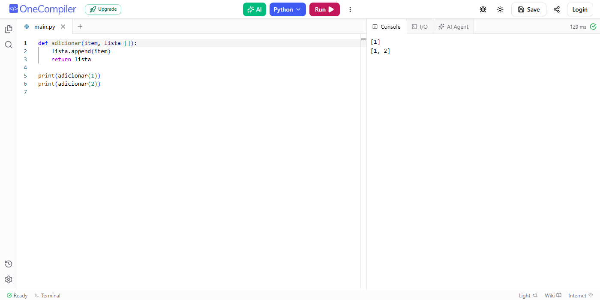
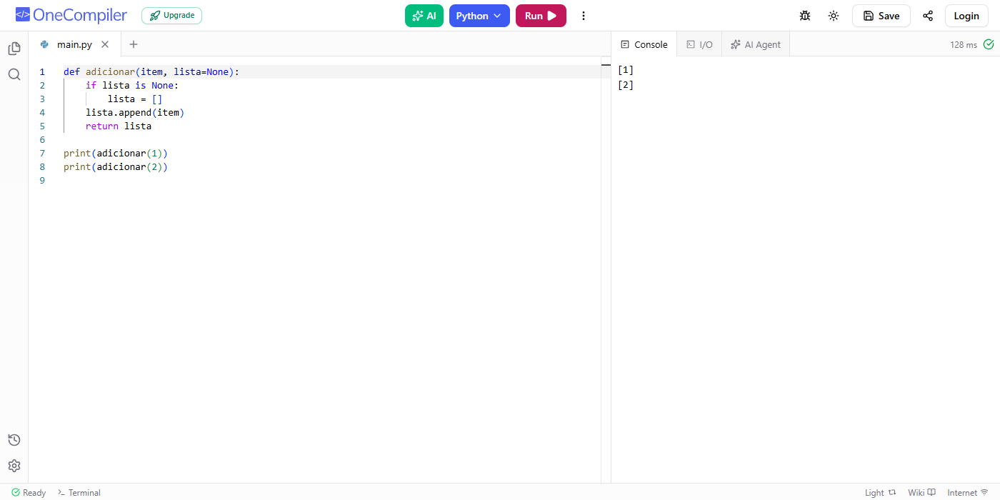
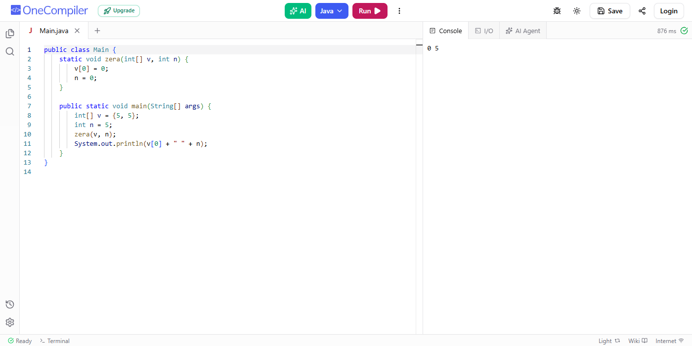

# Exercício 1/3 — Qual é a saída?

Para cada trecho: **(a)** qual é a saída? **(b)** qual conceito da aula explica?

---

## 1 · Python

```python
def adicionar(item, lista=[]):
    lista.append(item)
    return lista

print(adicionar(1))
print(adicionar(2))
```

**(a) Saída:**

```
[1]
[1, 2]
```



**(b) Conceito:** **argumento padrão mutável**.

A lista `lista=[]` é criada **uma única vez**, quando a função é definida (o valor padrão é avaliado no `def`, não a cada chamada). Por isso, ela é reutilizada nas chamadas seguintes:

- `adicionar(1)` → `[1]`
- `adicionar(2)` → a mesma lista, agora `[1, 2]`

### Correção

Usar `None` como padrão e criar a lista dentro da função, para que cada chamada tenha a sua:

```python
def adicionar(item, lista=None):
    if lista is None:
        lista = []
    lista.append(item)
    return lista

print(adicionar(1))
print(adicionar(2))
```

Saída:

```
[1]
[2]
```



---

## 2 · Java

```java
public class Main {
    static void zera(int[] v, int n) {
        v[0] = 0;
        n = 0;
    }

    public static void main(String[] args) {
        int[] v = {5, 5};
        int n = 5;
        zera(v, n);
        System.out.println(v[0] + " " + n);
    }
}
```

**(a) Saída:**

```
0 5
```



**(b) Conceito:** **passagem por valor (inclusive de referências)**.

Em Java, `n` é um `int`, então uma **cópia do valor** é passada para `zera()`. Alterar `n` dentro da função não altera o `n` original.

Já `v` é uma referência para um array. A **cópia da referência** continua apontando para o **mesmo array**, então `v[0] = 0;` altera o array original.

Assim, no final: `v[0] = 0` e `n = 5`.

> Esse código não tem erro — o comportamento é o esperado pela semântica do Java, então não precisa de correção.

---

**Arquivos:** [q1_original.py](q1_original.py) · [q1_corrigido.py](q1_corrigido.py) · [Main.java](Main.java)
