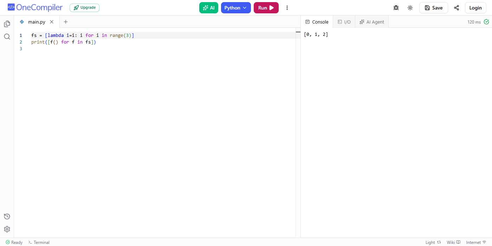
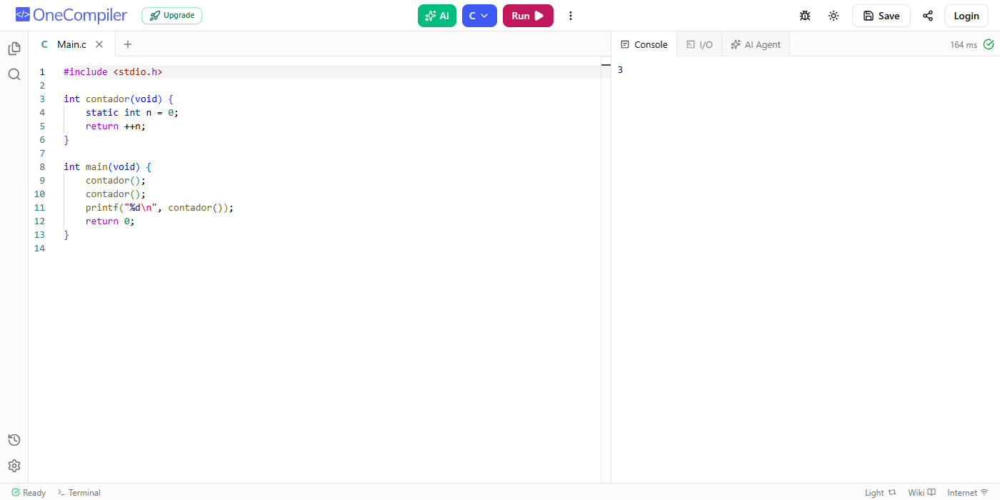

# Exercício 2/3 — Qual é a saída?

Para cada trecho: **(a)** qual é a saída? **(b)** qual conceito da aula explica?

---

## 3 · Python

```python
fs = [lambda: i for i in range(3)]
print([f() for f in fs])
```

**(a) Saída:**

```
[2, 2, 2]
```


**(b) Conceito:** **fechamento (closure) e ligação tardia (late binding)**.

As `lambda` não guardam uma cópia de `i` a cada iteração. Todas ficam referenciando a **mesma variável** `i` do ambiente onde foram criadas.

Quando as funções são executadas, o `for` já terminou e `i` vale `2`. Por isso, todas retornam `2`.

### Correção

Capturar o valor de `i` no momento da criação usando um parâmetro com valor padrão (`i=i`), que é avaliado na definição de cada `lambda`:

```python
fs = [lambda i=i: i for i in range(3)]
print([f() for f in fs])
```

Saída:

```
[0, 1, 2]
```



---

## 4 · C

```c
#include <stdio.h>

int contador(void) {
    static int n = 0;
    return ++n;
}

int main(void) {
    contador();
    contador();
    printf("%d\n", contador());
    return 0;
}
```

**(a) Saída:**

```
3
```



**(b) Conceito:** **variável local `static`** (tempo de vida estático, escopo local).

A variável `static int n = 0;` é inicializada **uma única vez** e mantém seu valor entre as chamadas da função (não fica na pilha, e sim na área de dados estáticos).

1. `contador()` → `n` passa de `0` para `1`
2. `contador()` → `n` passa de `1` para `2`
3. `contador()` → `n` passa de `2` para `3`

Portanto, o `printf` imprime **3**.

> Esse código não tem erro — o `static` é usado de propósito, então não precisa de correção.

---

**Arquivos:** [q3_original.py](q3_original.py) · [q3_corrigido.py](q3_corrigido.py) · [q4.c](q4.c)
