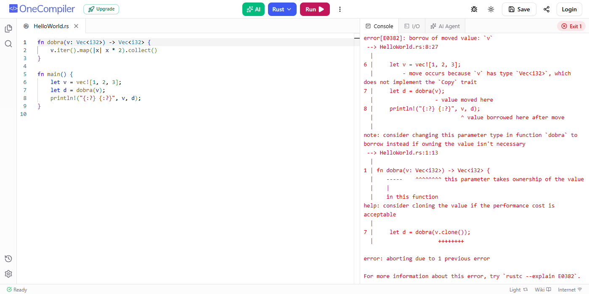
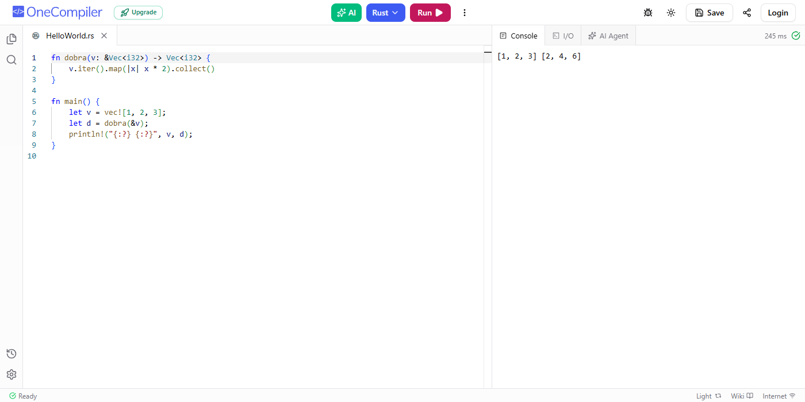
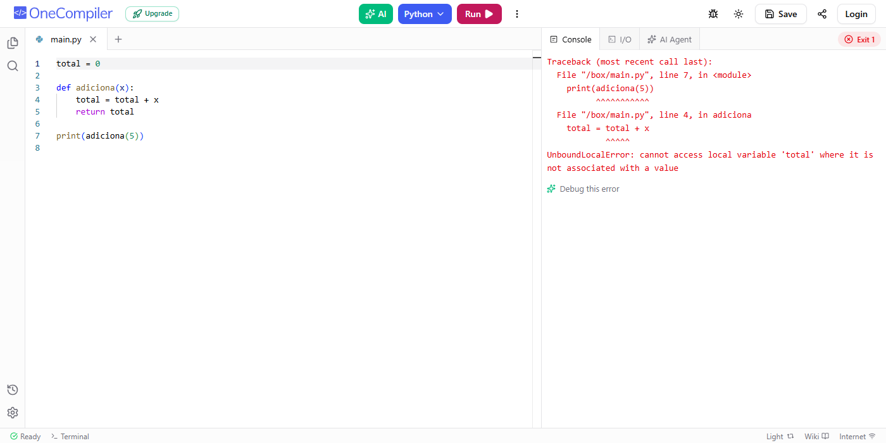
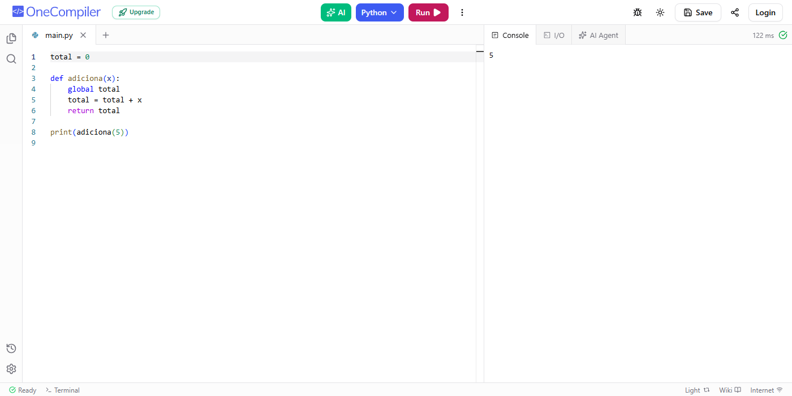

# Exercício 3/3 — Qual é a saída?

Para cada trecho: **(a)** qual é a saída? **(b)** qual conceito da aula explica?

---

## 5 · Rust

```rust
fn dobra(v: Vec<i32>) -> Vec<i32> {
    v.iter().map(|x| x * 2).collect()
}

fn main() {
    let v = vec![1, 2, 3];
    let d = dobra(v);
    println!("{:?} {:?}", v, d);
}
```

**(a) Saída:** **não compila** — `error[E0382]: borrow of moved value: 'v'`.



**(b) Conceito:** **posse (ownership) e move**.

Ao chamar `dobra(v)`, o `v` é **movido** para a função, porque `Vec<i32>` não implementa `Copy`. A função `dobra` passa a ser dona do vetor e, depois de `let d = dobra(v);`, a variável `v` não pode mais ser usada. O `println!` tenta usar `v` e gera o erro de compilação.

### Correção

Passar uma **referência** (empréstimo / borrow) em vez de mover o vetor. Assim, `main` continua dona de `v`:

```rust
fn dobra(v: &Vec<i32>) -> Vec<i32> {
    v.iter().map(|x| x * 2).collect()
}

fn main() {
    let v = vec![1, 2, 3];
    let d = dobra(&v);
    println!("{:?} {:?}", v, d);
}
```

Saída:

```
[1, 2, 3] [2, 4, 6]
```



> Outra opção seria `dobra(v.clone())`, mas isso copia o vetor inteiro sem necessidade.

---

## 6 · Python

```python
total = 0

def adiciona(x):
    total = total + x
    return total

print(adiciona(5))
```

**(a) Saída:** **erro** — `UnboundLocalError: cannot access local variable 'total' where it is not associated with a value`.



**(b) Conceito:** **escopo de variáveis (regra LEGB)**.

Como existe uma atribuição a `total` dentro da função, o Python decide (em tempo de compilação) que `total` é uma **variável local** de `adiciona`. Então, ao executar `total + x`, ele tenta ler a variável local antes que ela tenha recebido um valor. O `total = 0` de fora é **global** e não é consultado.

### Correção

Declarar `global total` para que a função use (e altere) a variável global:

```python
total = 0

def adiciona(x):
    global total
    total = total + x
    return total

print(adiciona(5))
```

Saída:

```
5
```



---

**Arquivos:** [q5_original.rs](q5_original.rs) · [q5_corrigido.rs](q5_corrigido.rs) · [q6_original.py](q6_original.py) · [q6_corrigido.py](q6_corrigido.py)
